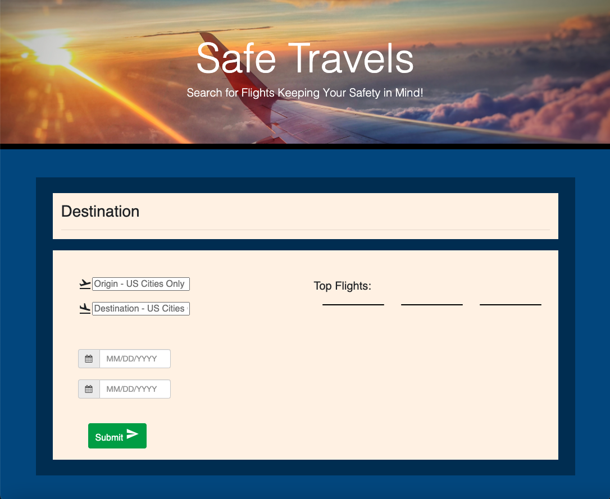
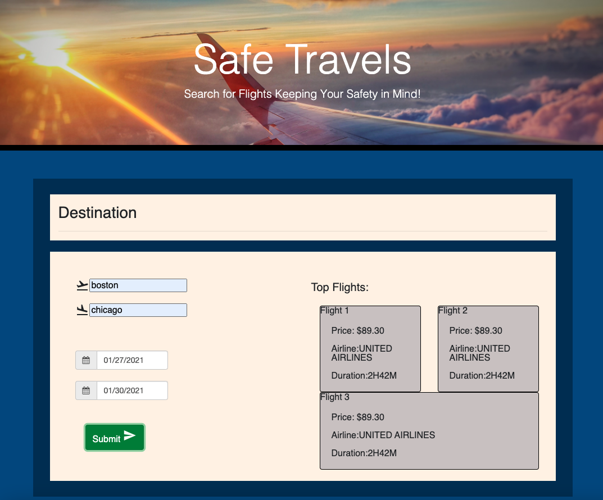
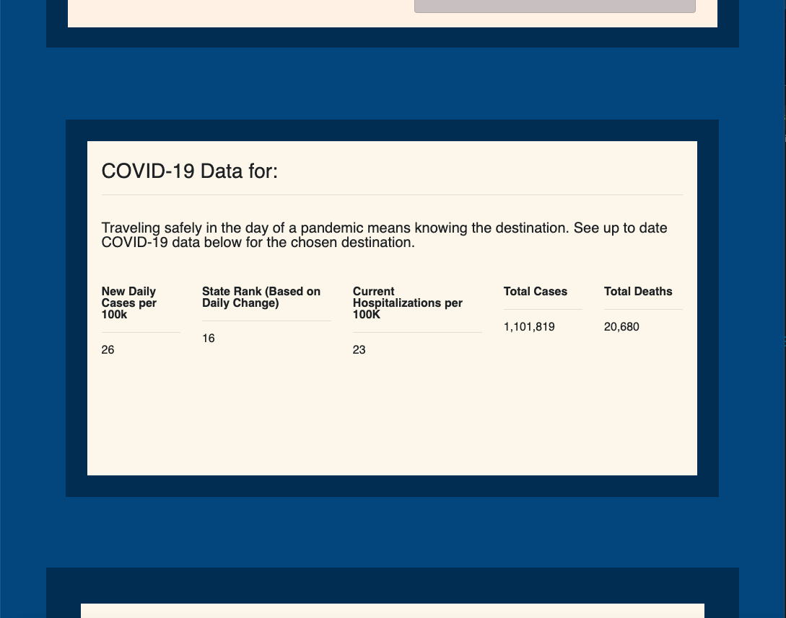
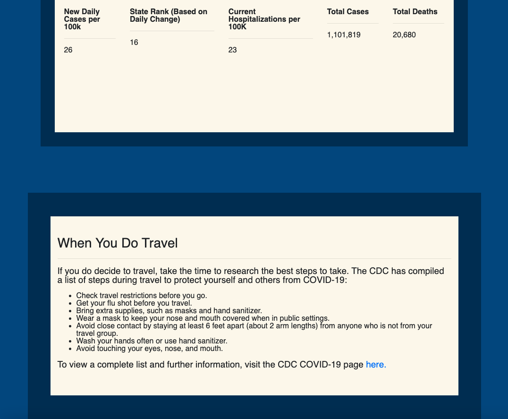

# project1: Safe Travels

# Description:

This app will search for available flights between two locations on specific dates. The user inputs their origin and destination. The search results include all available flights, price, and recent COVID data for the destination location.

## User Story:

AS A person who likes to travel
I WANT TO search for flights as well as recent COVID data for the destination location
SO THAT I can determine both the cheapest flight and safest location.

GIVEN I am using a website to search for flights
WHEN I open the page
THEN I enter location origin, location destination, and date
WHEN I hit the search button
THEN I receive a list of potential flights and recent COVID data for the destination location






To visit Safe Travels [click here](https://jjannross.github.io/project1/)

## Prerequisites

Before you begin, ensure you have met the following requirements:

- You have installed the latest version of `<coding_language/dependency/requirement_1>`
- You have a `<Windows/Linux/Mac>` machine.

## Installing <jjannross.github.io/project1>

To install <jjannross.github.io/project1>, follow these steps:

Linux and macOS:

```
<install_command>
```

Windows:

```
<install_command>
```

## Using <jjannross.github.io/project1>

To use <jjannross.github.io/project1>, follow these steps:

```
<usage_example>
```

## Contributing to <jjannross.github.io/project1>

To contribute to <jjannross.github.io/project1>, follow these steps:

1. Fork this repository.
2. Create a branch: `git checkout -b <branch_name>`.
3. Make your changes and commit them: `git commit -m '<commit_message>'`
4. Push to the original branch: `git push origin <jjannross.github.io/project1>/<location>`
5. Create the pull request.

Alternatively see the GitHub documentation on [creating a pull request](https://help.github.com/en/github/collaborating-with-issues-and-pull-requests/creating-a-pull-request).

## Contact

You can reach out to each contributer at:
<jjannross@gmail.com>
<dwill629@gmail.com>
<huseynovf1987@gmail.com>
<jlc42302@gmail.com>
<jrdavis4@gmail.com>

## License

Copyright (c) [2020] [Jennifer Smith]

Permission is hereby granted, free of charge, to any person obtaining a copy
of this software and associated documentation files (the "Software"), to deal
in the Software without restriction, including without limitation the rights
to use, copy, modify, merge, publish, distribute, sublicense, and/or sell
copies of the Software, and to permit persons to whom the Software is
furnished to do so, subject to the following conditions:

The above copyright notice and this permission notice shall be included in all
copies or substantial portions of the Software.

THE SOFTWARE IS PROVIDED "AS IS", WITHOUT WARRANTY OF ANY KIND, EXPRESS OR
IMPLIED, INCLUDING BUT NOT LIMITED TO THE WARRANTIES OF MERCHANTABILITY,
FITNESS FOR A PARTICULAR PURPOSE AND NONINFRINGEMENT. IN NO EVENT SHALL THE
AUTHORS OR COPYRIGHT HOLDERS BE LIABLE FOR ANY CLAIM, DAMAGES OR OTHER
LIABILITY, WHETHER IN AN ACTION OF CONTRACT, TORT OR OTHERWISE, ARISING FROM,
OUT OF OR IN CONNECTION WITH THE SOFTWARE OR THE USE OR OTHER DEALINGS IN THE
SOFTWARE.
